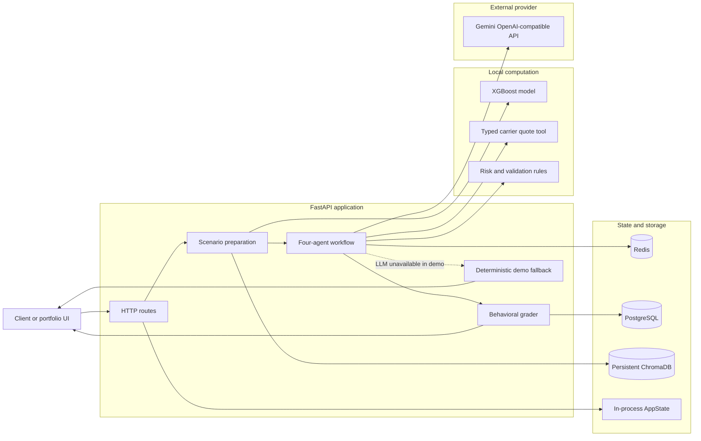
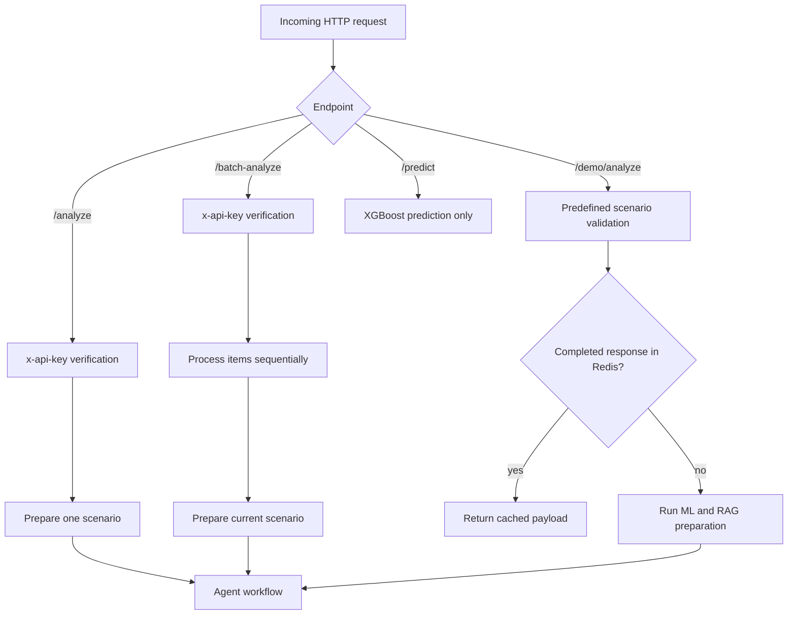
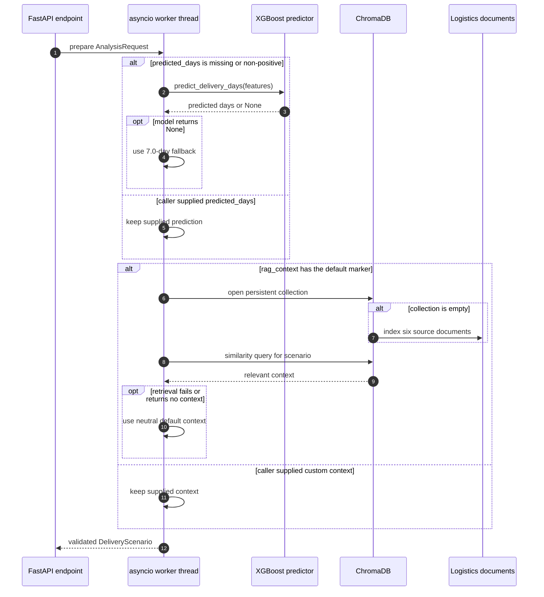
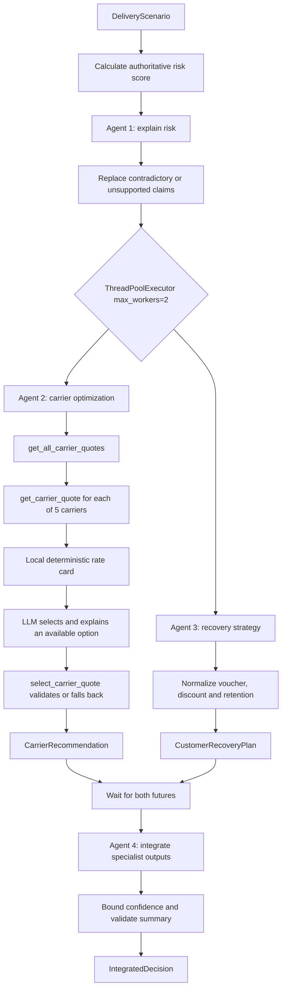
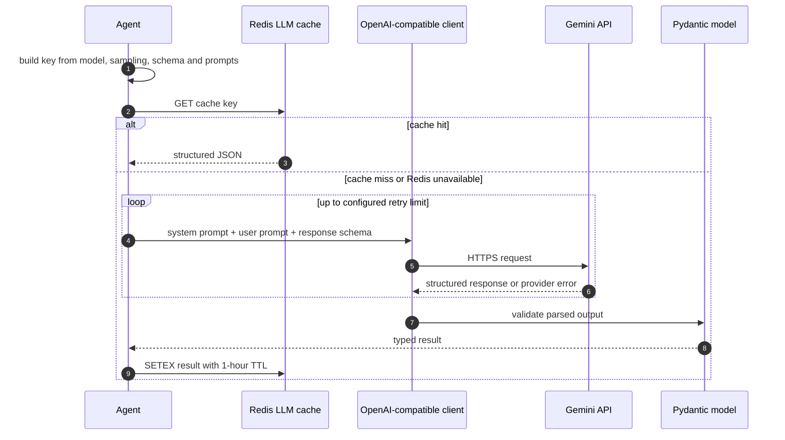
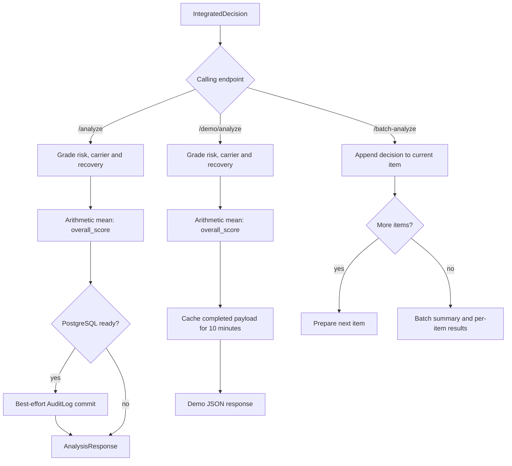
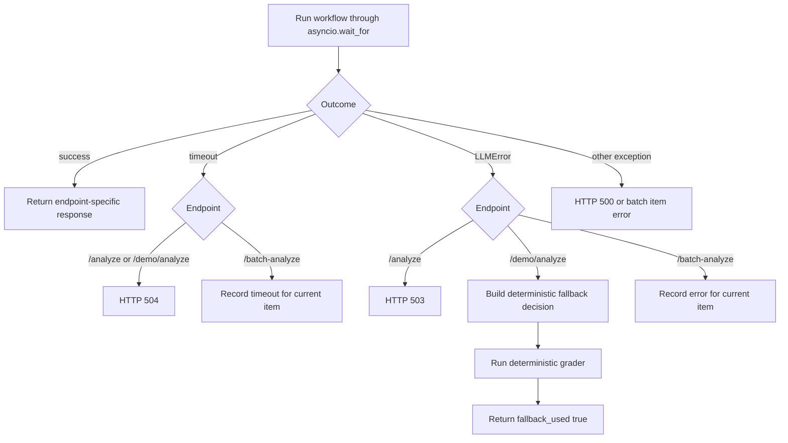

# Runtime Architecture Flow

This document describes the behavior implemented by the current code. The
workflow uses explicit Python orchestration: LLMs propose typed specialist
outputs, while deterministic code owns risk scoring, carrier quotes, fallback
selection, grading, timeouts, and persistence decisions.

## System overview

Redis is an optimization rather than a correctness dependency. ChromaDB is an
enrichment layer and falls back to neutral context when retrieval fails.
PostgreSQL audit persistence is best effort and applies only to successful
authenticated `/analyze` requests.

## Endpoint entry paths

`rate_limit_check` is currently a permissive extension hook; it does not yet
enforce a production rate limit. The portfolio page at `/` uses Basic Auth,
while the predefined demo-analysis endpoint itself is public.

## Scenario preparation: ML and RAG

`/analyze` and each `/batch-analyze` item use
`_prepare_analysis_scenario`. The demo follows the same logical preparation
with fixed server-side inputs.

Blocking ML and vector operations run through `asyncio.to_thread`, keeping the
FastAPI event loop available for other requests.

## Agent orchestration and concurrency

Agent 1 must finish first because its normalized risk output is an input to
Agents 2 and 3. Only Agents 2 and 3 execute concurrently. Agent 4 starts after
both futures have completed.

The carrier capability is deliberately split into three responsibilities:

1. `get_carrier_quote` is the core typed deterministic tool.
2. `get_all_carrier_quotes` calls it for every local carrier profile.
3. `select_carrier_quote` validates the LLM recommendation and chooses the
   fastest or cheapest available fallback when necessary.

The tool does not call a production carrier API. Its Pydantic contracts allow
the local rate card to be replaced later by an authenticated REST or MCP
implementation without changing the agent-facing result shape.

## One LLM call and its Redis cache

Every agent calls the same provider-neutral `call_ollama` function. The legacy
name is retained for compatibility; the configured implementation uses an
OpenAI-compatible client and currently targets Gemini.

Authentication, invalid-request, retired-endpoint, and quota errors are treated
as permanent for the current request and are not repeatedly retried. Redis
connection or command failures only disable the cache path.

## Grading, persistence, and response behavior

The grader's `overall_score` and Agent 4's `confidence_score` are separate
values. The former is the arithmetic mean of three deterministic specialist
scores; the latter is a bounded evidence-quality estimate in the decision.

## Timeouts and failure paths

The authenticated analysis endpoint never presents a deterministic fallback as
an LLM-generated decision. The public demo explicitly exposes `fallback_used`
and `fallback_reason` so the degraded mode remains visible.

## State ownership

| State | Owner | Lifetime | Role |
|---|---|---|---|
| Request and agent values | Pydantic models | One analysis | Validate boundaries between stages |
| Counters and latency | `AppState` | Process lifetime | `/status` operational metrics |
| Database readiness | `app.state.db_ready` | Refreshed at runtime | Gate best-effort audit writes |
| LLM response cache | Redis | 1-hour TTL | Reuse schema-aware agent responses |
| Demo response cache | Redis | 10-minute TTL | Reuse complete predefined results |
| Audit log | PostgreSQL/SQLModel | Durable | Store successful `/analyze` inputs and decisions |
| Vector collection | Persistent ChromaDB | Durable local volume | Retrieve logistics knowledge context |

## Source map

| Responsibility | Implementation |
|---|---|
| HTTP endpoints, preparation, timeout and grading | `main.py` |
| Agent models, LLM client, Redis and orchestration | `pydantic_agents.py` |
| Carrier quote contracts and deterministic rate card | `carrier_tools.py` |
| XGBoost inference | `ml_predictor.py` |
| ChromaDB indexing and retrieval | `chroma_db_manager.py` |
| PostgreSQL engine and sessions | `database.py` |
| SQLModel audit tables | `models.py` |
| Prompts and deterministic grader | `prompt_engineering.py` |
