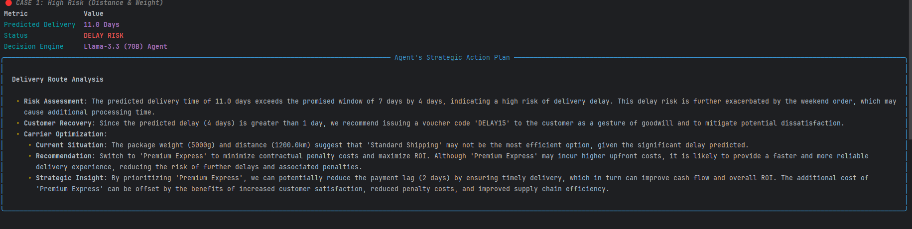
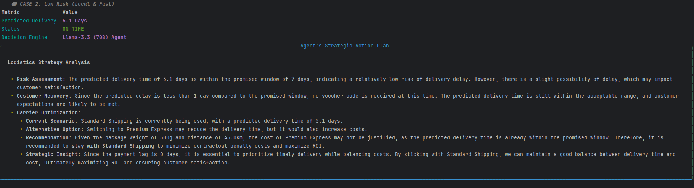

# 📦 ALRA: Autonomous Logistics Recovery Agent

**ALRA** is an end-to-end Decision Intelligence system that predicts e-commerce delivery delays and autonomously initiates customer recovery protocols.
It bridges the gap between raw Machine Learning and strategic business action.

## 🚀 Key Features
* **Predictive Engine:** Custom-trained **XGBoost** model analyzing 11 business features (Distance, Weight, Payment Lag, Seasonality) based on the Olist dataset.
* **Agentic Reasoning:** Integrated **Llama 3.3 (70B)** via Groq to perform real-time risk assessment and ROI-driven decision making.
* **Automated Recovery:** Autonomously issues compensation vouchers (`DELAY15`) and suggests carrier upgrades (Standard vs. Premium Express) based on contractual penalty analysis.
* **Hardware Optimized:** Inference accelerated on **AMD Radeon RX 6650 XT** via DirectML libraries.

## 🛠 Tech Stack
* **Language:** Python 3.10+
* **ML Framework:** XGBoost, Scikit-learn, Pandas
* **AI Orchestration:** Groq Cloud API (Llama 3.3 70B)
* **Hardware Acceleration:** AMD RDNA2 / DirectML
* **Interface:** Rich (Interactive CLI Dashboard)

## 📊 System Logic (Simulation Cases)
The system evaluates three distinct business scenarios:
1.  **🔴 High Risk:** Long-distance, heavy packages during peak seasons (e.g., Black Friday).
    * *Action:* Issue Voucher + Switch Carrier.
2.  **🟢 Low Risk:** Local, lightweight deliveries optimized for high margins.
    * *Action:* Standard Monitoring.
3.  **🟡 Edge Case:** Impact of payment processing delays (`payment_lag`) combined with weekend bottlenecks.
    * *Action:* Proactive Alerting.

## 📸 Dashboard Examples

Below are real outputs generated by the ALRA system via the CLI interface.

### 🔴 Case 1: High Risk Scenario (Recovery Protocol)
**Input:** Heavy package (5kg), Long distance (1200km), Peak Season.
**Agent Action:** The system detects a high probability of delay vs. the promise. It automatically generates a **'DELAY15' voucher** and suggests switching to **Premium Express** to avoid SLA penalties.

---

### 🟢 Case 2: Low Risk Scenario (Efficiency Check)
**Input:** Lightweight package (0.5kg), Local delivery (45km), Off-season.
**Agent Action:** The system confirms the delivery is on track (5.1 days vs 7 days promised). It advises **Standard Shipping** to protect profit margins, avoiding unnecessary intervention.

