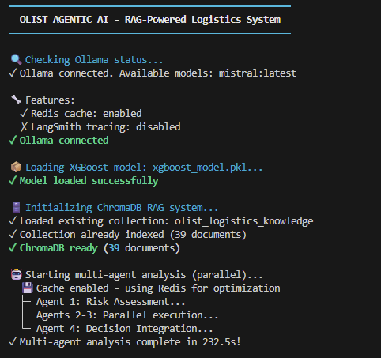
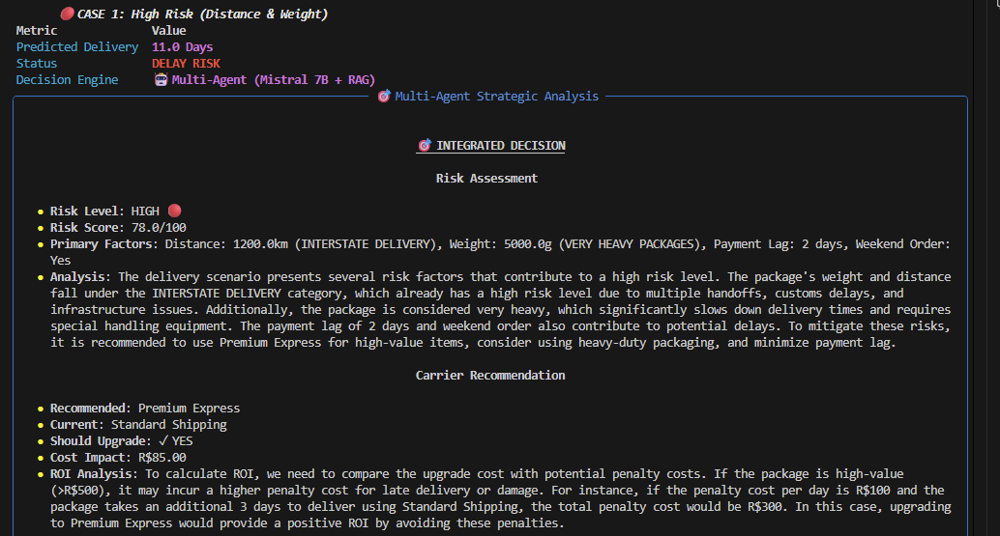
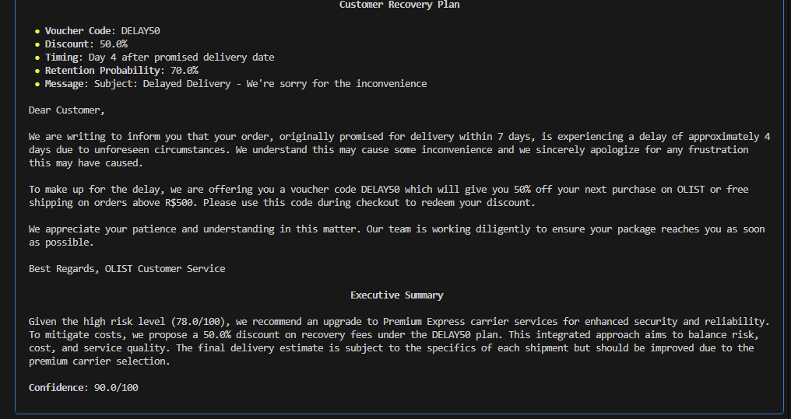

# 🤖 AgenticAI - Multi-Agent Logistics Decision System

A Decision Intelligence system combining ML predictions with Multi-Agent LLM architecture for autonomous e-commerce delivery risk analysis.

---

## 🎯 What does this system do?

The system takes order data (weight, distance, payment lag, etc.) and:

1. **ML Prediction** - XGBoost model predicts delivery time
2. **RAG Context** - ChromaDB retrieves relevant logistics rules
3. **Agent Analysis** - 4 specialized AI agents analyze the scenario in parallel
4. **Decision** - System generates recommendations: voucher, carrier upgrade, customer communication

---

## 📐 System Architecture

```
┌─────────────────────────────────────────────────────────────────────────────┐
│                         OLIST AGENTIC AI SYSTEM                             │
├─────────────────────────────────────────────────────────────────────────────┤
│                                                                             │
│  ┌──────────────┐    ┌──────────────┐    ┌──────────────────────────────┐  │
│  │   INPUT      │    │   XGBOOST    │    │     CHROMADB RAG             │  │
│  │  Delivery    │───▶│   Model      │───▶│  ┌────────────────────────┐  │  │
│  │  Scenario    │    │              │    │  │ Semantic Search        │  │  │
│  └──────────────┘    └──────────────┘    │  │ all-MiniLM-L6-v2       │  │  │
│                             │            │  │ 39 Knowledge Chunks    │  │  │
│                             ▼            │  └────────────────────────┘  │  │
│                      Predicted Days      └──────────────┬───────────────┘  │
│                             │                           │                  │
│                             ▼                           ▼                  │
│  ┌──────────────────────────────────────────────────────────────────────┐  │
│  │                    MULTI-AGENT ORCHESTRATION                         │  │
│  │  ┌─────────────────────────────────────────────────────────────────┐ │  │
│  │  │                    Ollama + Mistral 7B                          │ │  │
│  │  │                   (Local LLM Inference)                         │ │  │
│  │  └─────────────────────────────────────────────────────────────────┘ │  │
│  │                              │                                       │  │
│  │        ┌─────────────────────┼─────────────────────┐                 │  │
│  │        ▼                     ▼                     ▼                 │  │
│  │  ┌───────────┐        ┌───────────┐        ┌───────────┐             │  │
│  │  │   RISK    │        │  CARRIER  │        │ RECOVERY  │             │  │
│  │  │   AGENT   │        │   AGENT   │        │   AGENT   │             │  │
│  │  │           │        │           │        │           │             │  │
│  │  │ • Score   │        │ • Upgrade │        │ • Voucher │             │  │
│  │  │ • Factors │        │ • Cost    │        │ • Timing  │             │  │
│  │  │ • Priority│        │ • ROI     │        │ • Message │             │  │
│  │  └─────┬─────┘        └─────┬─────┘        └─────┬─────┘             │  │
│  │        │                    │                    │                   │  │
│  │        └────────────────────┼────────────────────┘                   │  │
│  │                             ▼                                        │  │
│  │                    ┌─────────────────┐                               │  │
│  │                    │  ORCHESTRATOR   │                               │  │
│  │                    │     AGENT       │                               │  │
│  │                    │                 │                               │  │
│  │                    │ Executive       │                               │  │
│  │                    │ Summary +       │                               │  │
│  │                    │ Confidence      │                               │  │
│  │                    └─────────────────┘                               │  │
│  └──────────────────────────────────────────────────────────────────────┘  │
│                              │                                             │
│                              ▼                                             │
│  ┌──────────────────────────────────────────────────────────────────────┐  │
│  │                      INTEGRATED DECISION                             │  │
│  │  • Risk Level (HIGH/MODERATE/LOW)    • Carrier Recommendation        │  │
│  │  • Voucher Code (DELAY15/DELAY50)    • Customer Communication        │  │
│  │  • ROI Analysis                      • Confidence Score              │  │
│  └──────────────────────────────────────────────────────────────────────┘  │
└─────────────────────────────────────────────────────────────────────────────┘
```

---

## 🧠 Multi-Agent Architecture

The system uses 4 specialized LLM agents (Mistral 7B via Ollama):

| Agent | Responsibility |
|-------|----------------|
| **Risk Agent** | Risk assessment (0-100), risk factor identification |
| **Carrier Agent** | Carrier recommendation, upgrade ROI analysis |
| **Recovery Agent** | Customer retention strategy, voucher codes |
| **Orchestrator** | Synthesis of all analyses, executive summary |

---

## 🛠️ Tech Stack

- **Python 3.10+**
- **Ollama + Mistral 7B** - Local LLM (no API keys needed)
- **ChromaDB** - Vector database for RAG
- **XGBoost** - Delivery time prediction model (R² = 0.41, room for improvement)
- **Pydantic** - LLM response type validation
- **Redis** - Response caching (optional)
- **Rich** - CLI interface

---

## 📦 Installation

```bash
# Clone repository
git clone https://github.com/GabrielWalak/Agentic-Logistics-Optimizer.git
cd Agentic-Logistics-Optimizer

# Create virtual environment
python -m venv .venv
.venv\Scripts\activate  # Windows

# Install dependencies
pip install pydantic ollama chromadb sentence-transformers xgboost scikit-learn pandas rich python-dotenv

# Pull Mistral model for Ollama
ollama pull mistral

# Run the system
python main.py
```

---

## 🎮 Usage

### Run full system
```bash
python main.py
```

### Test agent connection
```bash
python pydantic_agents.py
```

---

## 📸 Screenshots

### System startup and initialization


### Multi-Agent System scenario analysis


### Final output with recommendations


---

## 📁 Project Structure

```
AgenticAI/
├── main.py                     # Entry point - workflow orchestration
├── pydantic_agents.py          # Multi-agent system with Pydantic models
├── chroma_db_manager.py        # ChromaDB vector database manager
├── logistics_knowledge_base.py # Domain documents for RAG
├── logistics_docs/             # Source knowledge files
│   ├── carrier_rules.txt
│   ├── customer_recovery.txt
│   ├── distance_guidelines.txt
│   └── ...
└── screenshots/                # Application screenshots
```

---

## 🔧 How it works

### 1. Input
```python
scenario = {
    'product_weight_g': 5000,      # Heavy package
    'distance_km': 1200.0,         # Long distance
    'payment_lag_days': 2,         # Payment delay
    'is_weekend_order': 1,         # Weekend order
    'freight_value': 85.00         # Freight cost
}
```

### 2. XGBoost Prediction
Model predicts: **9.2 days** (promised 7 days → DELAY RISK)

### 3. RAG Context
ChromaDB finds relevant documents:
- "Distance >800km requires Premium Express"
- "Weekend orders +1-2 days processing"

### 4. Multi-Agent Analysis
Agents analyze in parallel and return:
- **Risk Score**: 85/100 (HIGH)
- **Carrier**: Upgrade to Premium Express
- **Voucher**: DELAY50 (50% discount on next order)
- **Confidence**: 90/100

---

## 📄 License

MIT License

---

<p align="center">
  <strong>Built with 🤖 Ollama + ChromaDB + XGBoost</strong>
</p>
